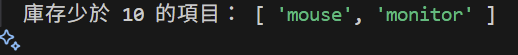
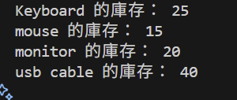
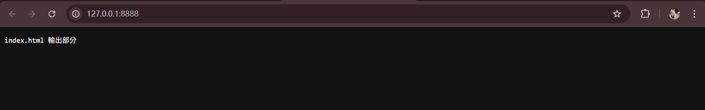
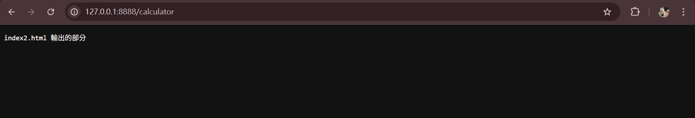
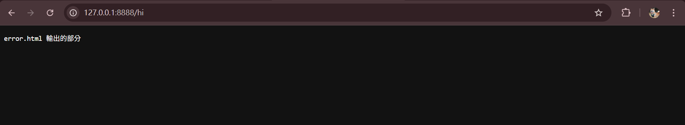
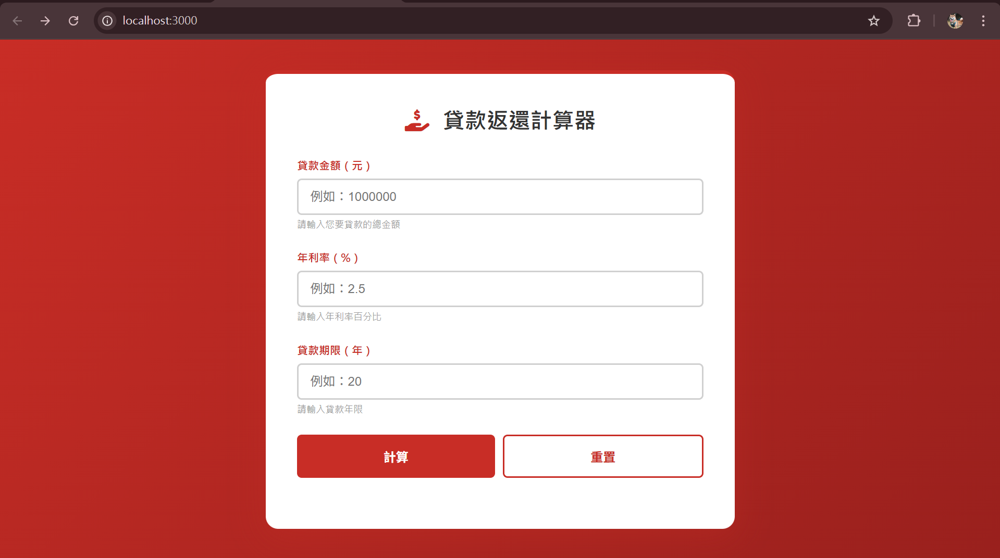
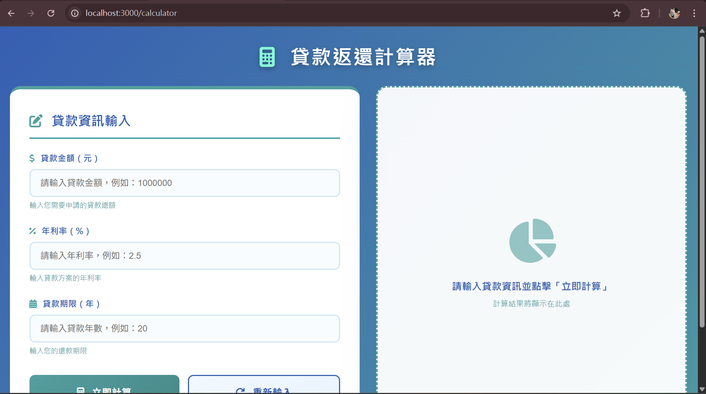
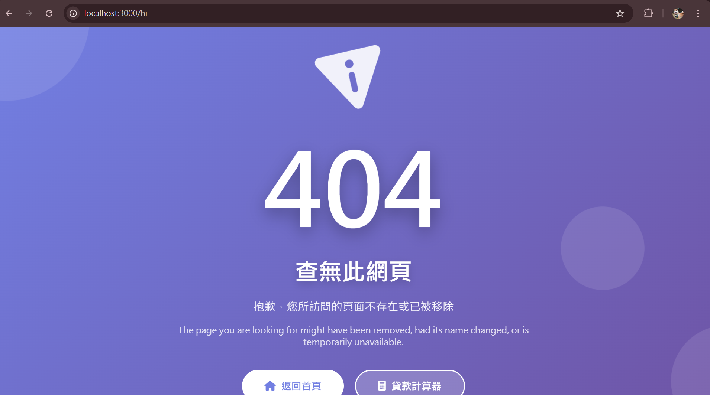

# 第2次隨堂題目-隨堂-QZ2
>
>學號：112111102
><br />
>姓名：吳映潔
>

本份文件包含以下主題：(至少需下面兩項，若是有多者可以自行新增)
- [x] 說明內容
- [x] 執行成果

## 說明程式與內容

1. a.

Ans: 


1. b.

Ans:

**程式：**

```js
function getLowStock(products) {
  return products
    .filter(item => item.stock < 10)
    .map(item => item.name);
}

const lowStockItems = getLowStock(products);
console.log("庫存少於 10 的項目：", lowStockItems);
```

**說明：**

這段程式是為了找出庫存少於10的商品名稱，先用.filter()篩選出庫存 < 10的商品，然後用.map()取得這些商品的名稱，最後呼叫函式回傳結果，並用console.log()依照規定輸出結果。

**執行結果：**


> 上圖為程式執行結果

> 上圖為程式執行結果
<!-- 請撰寫時，最後一句話再寫一次 -->


1. c.

Ans:

**程式：**

**程式：**

```js
function updateStock(products, updates) {
  const updatesObj = {};
  updates.split(",").forEach(pair => {
    const [name, stockStr] = pair.split(":");
    updatesObj[name.trim()] = Number(stockStr);
  });
  for (let item of products) {
    if (updatesObj.hasOwnProperty(item.name)) {
      item.stock = updatesObj[item.name];
    }
  }
  for (let item of products) {
    console.log(`${item.name} 的庫存： ${item.stock}`);
  }
  return products;
}

updateStock(products, "mouse:15,monitor:20");

```

**說明：**

承接上題(1b)，這段程式是為了更新商品陣列中商品的庫存數量，先將將傳入的updates字串（格式為 "商品名:庫存,商品名:庫存"）用split()分割，再轉換成物件updatesObj，然後用 : 分割每組名稱與庫存，建立updatesObj儲存更新資料，再來針對products陣列中的每個商品，如果商品名稱存在於updatesObj中，則將其庫存更新為新的數量，以及使用console.log()印出更新後每個商品的庫存狀況，最後呼叫函數執行updateStock。


**執行結果：**


>上圖為程式執行結果

<!--  請撰寫時，第一句話再寫一次  -->

2. a.

Ans:

**程式：**

**程式：**

```js
   switch(url) {
    case '/':
      answer = 'index.html 輸出部分';
      break;
    case '/calculator':
      answer = 'index2.html 輸出的部分';
      break;
    default:
      answer = 'error.html 輸出的部分';
  }
```

**說明：**

這段程式是為了根據請求的URL，回傳對應的回應內容，程式中使用switch判斷請求的url，如果url為/，網頁裡要出現"index.html 輸出部分"的文字;如果url為/calculator，網頁裡要出現"index2.html 輸出的部分"的文字;如果若url為其他(例如/hi)，網頁裡要出現"error.html 輸出的部分"的文字。

**執行結果：**


> 當請求url為`/`時，網頁呈現畫面


> 當請求url為`/calculato`時，網頁呈現畫面


> 當請求url為其他如`/hi`時，網頁呈現畫面


<!--  請撰寫時，第一句話再寫一次  -->

2. b.

Ans:

**程式：**

**程式：**

```js
switch(req.url) {
  case '/':
    filePath = '/index.ejs';
    break;
  case '/calculator':
    filePath = '/index2.ejs';
    break;
}
```

**說明：**
這段程式是為了根據請求的URL，回傳對應的回應內容，程式中使用switch 判斷請求的url，如果url為/，網頁要是index.ejs的畫面，如果url為/calculator，網頁要是index2.ejs的畫面。


**執行結果：**


>當請求url為`/`時，網頁呈現畫面


>當請求url為`/calculator`時，網頁呈現畫面


<!--  請撰寫時，第一句話再寫一次  -->

2. c.

Ans:

**程式：**

**程式：**

```js
fs.readFile(staticFilePath, (err, content) => {
  if (err) {
    fs.readFile('./index3.ejs', 'utf8', (err2, template) => {
      if (err2) {
        res.writeHead(500, { 'Content-Type': 'text/html; charset=utf-8' });
        res.end('錯誤：無法讀取模板文件 - ' + err2.message);
        return;
      }
      const html = ejs.render(template);
      res.writeHead(404, { 'Content-Type': 'text/html; charset=utf-8' });
      res.end(html);
    });
  } else {
    res.writeHead(200, { 'Content-Type': contentType });
    res.end(content);
  }
});

```

**說明：**
這段程式為試著讀取靜態資源並處理錯誤請求，先試著讀取靜態資源，如果讀取失敗，代表使用者請求的路徑不存在，則**讀取 index3.ejs 作為 404 畫面**，再將index3.ejs渲染成HTML後回傳給使用者，HTTP狀態碼設定為 404，如果靜態資源讀取成功，直接回傳內容給使用者，HTTP狀態碼為 200。


**執行結果：**


>當請求url為其他如`/hi`時，網頁呈現畫面

>當請求url為其他如`/hi`時，網頁呈現畫面

<!--  請撰寫時，第一句話和最後一句再寫一次  -->

2. d.

Ans:


